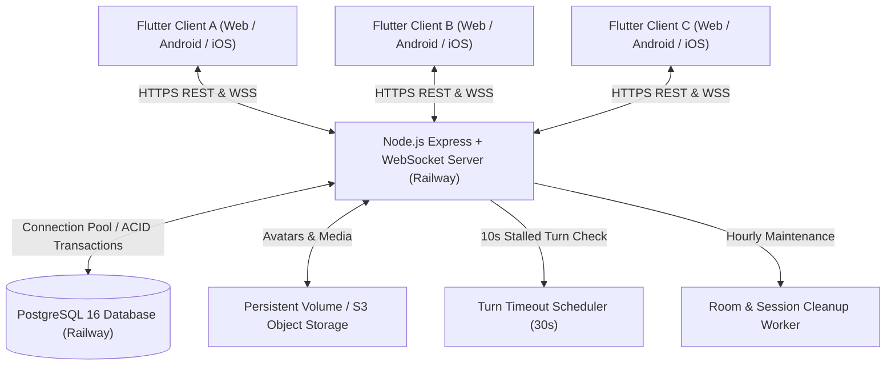

# ARCHITECTURE.md — مۆنۆپۆلی هەولێر (Hawler Monopoly)

## 1. System Architecture Overview

---

## 2. Frontend Architecture (Flutter)

- **Pattern**: Clean Architecture with strict separation of Presentation, Domain, and Data layers.
- **State Management**: Riverpod (`StateNotifierProvider`, `StreamProvider`, `FutureProvider`).
- **Routing**: `go_router` with declarative routing and route guards for authenticated screens.
- **RTL & Kurdish Localization**: Native Kurdish Sorani UI with full RTL directionality, cultural Kurdish theming (Citadel, Qaysari Bazaar, Erbil landmarks), and typography (Vazirmatn / Outfit).
- **Audio & Haptics**: Built-in `SoundService` with Web AudioContext oscillator synthesis and `HapticFeedback` for device vibration on mobile.
- **Layer Structure**:
  - `lib/core/` — Kurdish themes, color palettes, luxury glassmorphism tokens, and reusable widgets (`TurnTimerWidget`, `ReconnectBanner`, `InAppNotificationOverlay`).
  - `lib/data/` — Remote `ApiClient`, `WebSocketService`, and `OnlineGameRepository`.
  - `lib/domain/` — 40-tile Hawler board definition, server-synchronized rules engine, AI Bot logic (6 personalities, 4 difficulties), chance & chest card decks.
  - `lib/presentation/` — `GameSessionController`, `ProfileState`, and application providers.
  - `lib/features/` — Board Screen, Online Lobby, Room Screen, Social & Friends, Shop & Cosmetics, Daily Rewards, Profile, Match History.

---

## 3. Backend Architecture (Node.js + Express + PostgreSQL)

- **Runtime**: Node.js 20 LTS containerized on Alpine Linux.
- **Server Framework**: Express 4.21 with Helmet security headers, CORS origin management, and `express-rate-limit`.
- **Authoritative Game Engine (`services/game_engine.js`)**:
  - Validates and executes 100% of game actions on the server.
  - Generates cryptographically secure dice rolls server-side.
  - Atomic database transactions (`transaction(async (db) => ...)`) ensure money deductions, property assignments, and game state updates never partially commit.
- **WebSocket Engine (`ws`)**:
  - Real-time bidirectional event streaming on `/ws`.
  - In-memory connection map with automatic heartbeat, reconnect state recovery, and room multicast.
- **Background Schedulers**:
  - **Turn Timer Scheduler**: 10-second ticker auto-advancing stalled turns after 30s.
  - **Room Maintenance Worker**: Hourly purge of abandoned lobby rooms and expired sessions.
- **Storage Service (`services/storage.js`)**:
  - MIME-validated image upload system with 5MB cap, MD5 collision prevention, and static file serving from `/uploads`.

---

## 4. Database Persistence Layer

- **Production Engine**: PostgreSQL 16 on Railway.
- **Connection Pool**: `pg.Pool` with 20 maximum connections, automatic SSL handling, and transaction isolation.
- **Development Engine**: Automatic fallback to SQLite (`data.db`) via `sql.js` for offline local development without external dependencies.
- **Schema Management**: Idempotent DDL scripts in `src/auto_setup.js` and `src/migrate.js` covering all 26 relational tables.

---

## 5. Network & Communication Protocol

| Protocol | Endpoint | Primary Use Case |
|---|---|---|
| **HTTPS (REST)** | `https://<domain>/api/*` | Authentication, User Profiles, Lobby Listings, Shop Purchases, Match History |
| **WSS (WebSocket)** | `wss://<domain>/ws` | Real-time Room Sync, Live Dice Rolls, Player Movement, Chat, Emoji Reactions, Turn Timeouts |
| **HTTPS (Health)** | `https://<domain>/health` | Railway Liveness / Readiness Probes, Version & DB Telemetry |
| **HTTPS (Landing)** | `https://<domain>/` | Kurdish Server Operations Dashboard |

