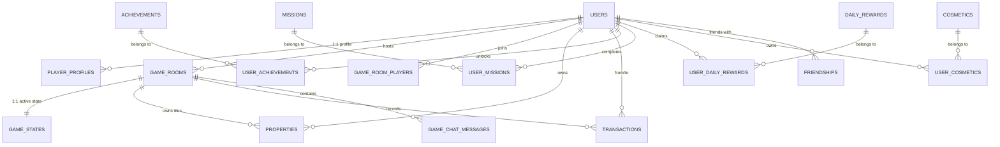

# DATABASE.md — مۆنۆپۆلی هەولێر (Hawler Monopoly)

Complete reference for the **26 PostgreSQL tables** and relationships powering **مۆنۆپۆلی هەولێر**.

---

## 1. Entity Relationship Diagram (Key Systems)

---

## 2. Table Specifications (All 26 Tables)

### Authentication & Profiles
1. **`users`**
   - `id` (TEXT PRIMARY KEY) — Unique UUID.
   - `username` (TEXT UNIQUE NOT NULL) — Case-insensitive login identifier.
   - `display_name` (TEXT NOT NULL DEFAULT 'یاریزان') — Player nickname.
   - `email` (TEXT) — Optional email.
   - `password_hash` (TEXT) — BCrypt hashed password (10 salt rounds).
   - `avatar_url` (TEXT) — Relative or absolute URL to avatar image.
   - `coins` (INTEGER NOT NULL DEFAULT 3000) — Primary currency.
   - `gems` (INTEGER NOT NULL DEFAULT 20) — Premium sapphire currency.
   - `xp` (INTEGER NOT NULL DEFAULT 0) — Total experience points.
   - `level` (INTEGER NOT NULL DEFAULT 1) — Player level (derived from XP).
   - `wins` (INTEGER NOT NULL DEFAULT 0) — Match victories count.
   - `games_played` (INTEGER NOT NULL DEFAULT 0) — Matches played count.
   - `streak` (INTEGER NOT NULL DEFAULT 0) — Consecutive daily login streak.
   - `last_login_at` (BIGINT) — Unix epoch timestamp.
   - `created_at` / `updated_at` (BIGINT) — Unix epoch timestamps.

2. **`player_profiles`**
   - `user_id` (TEXT PRIMARY KEY REFERENCES users(id) ON DELETE CASCADE)
   - `title` (TEXT), `bio` (TEXT), `selected_avatar` (TEXT), `selected_title` (TEXT).
   - `cosmetics` (JSONB DEFAULT '{}') — Equipped cosmetics mapping.
   - `stats` (JSONB DEFAULT '{}') — Additional profile statistics.

3. **`user_sessions`**
   - `id` (TEXT PRIMARY KEY) — Session token ID.
   - `user_id` (TEXT REFERENCES users(id) ON DELETE CASCADE).
   - `room_code` (TEXT), `ws_id` (TEXT), `last_active` (BIGINT), `created_at` (BIGINT).
   - Index: `idx_session_user (user_id)`.

---

### Rooms & Multiplayer Game State
4. **`game_rooms`**
   - `code` (TEXT PRIMARY KEY) — 5-character uppercase room code.
   - `host_id` (TEXT NOT NULL REFERENCES users(id)) — Room owner.
   - `room_name` (TEXT NOT NULL DEFAULT '') — Custom room name.
   - `status` (TEXT NOT NULL DEFAULT 'lobby') — `'lobby'`, `'playing'`, `'closed'`.
   - `max_players` (INTEGER NOT NULL DEFAULT 6).
   - `is_public` (INTEGER NOT NULL DEFAULT 0) — `1` for public matchmaking, `0` for private.
   - `start_cash` (INTEGER NOT NULL DEFAULT 1500).
   - `version` (INTEGER NOT NULL DEFAULT 0) — Optimistic concurrency version.
   - `created_at`, `updated_at`, `started_at`, `finished_at` (BIGINT).

5. **`game_room_players`**
   - `room_code` (TEXT NOT NULL REFERENCES game_rooms(code) ON DELETE CASCADE).
   - `user_id` (TEXT NOT NULL REFERENCES users(id)).
   - `character_id` (TEXT NOT NULL DEFAULT 'business') — Token character ID.
   - `seat` (INTEGER NOT NULL DEFAULT 0).
   - `ready` (INTEGER NOT NULL DEFAULT 0) — Ready status toggle.
   - `connected` (INTEGER NOT NULL DEFAULT 1) — Real-time connection flag.
   - `joined_at` (BIGINT).
   - Composite Primary Key: `(room_code, user_id)`.

6. **`game_states` (Server-Authoritative State)**
   - `room_code` (TEXT PRIMARY KEY REFERENCES game_rooms(code) ON DELETE CASCADE).
   - `round` (INTEGER NOT NULL DEFAULT 1) — Current round number.
   - `current_player_index` (INTEGER NOT NULL DEFAULT 0) — Active player turn.
   - `phase` (TEXT NOT NULL DEFAULT 'awaitingRoll') — Game state machine phase (`'awaitingRoll'`, `'rolling'`, `'moving'`, `'landing'`, `'propertyDecision'`, `'auctioning'`, `'endTurn'`, `'gameOver'`).
   - `dice` (TEXT NOT NULL DEFAULT '[1,1]') — Active dice roll values.
   - `players` (JSONB NOT NULL DEFAULT '[]') — Array of player states (cash, position, in_jail, bankrupt, etc.).
   - `tiles` (JSONB NOT NULL DEFAULT '{}') — Mappings of board tile ownership and upgrades.
   - `free_coins` (INTEGER NOT NULL DEFAULT 0) — Center pot jackpot.
   - `winner_id` (TEXT DEFAULT '') — Winner user ID when game completes.
   - `dice_multiplier` (INTEGER NOT NULL DEFAULT 1).
   - `dice_energy` (INTEGER NOT NULL DEFAULT 10) / `max_dice_energy` (INTEGER NOT NULL DEFAULT 10).
   - `active_event` (JSONB) — Active economic modifier event.
   - `pending_trade` (JSONB) — Active P2P trade proposal.
   - `auction` (JSONB) — Active auction state.
   - `state_version` (INTEGER NOT NULL DEFAULT 1) — Monotonic state counter.
   - `turn_started_at` (BIGINT) — Timestamp when turn began (used by 30s auto-advance).

7. **`properties`**
   - `id` (SERIAL PRIMARY KEY).
   - `room_code` (TEXT NOT NULL REFERENCES game_rooms(code) ON DELETE CASCADE).
   - `tile_index` (INTEGER NOT NULL) — 0 to 39 tile index on board.
   - `owner_id` (TEXT REFERENCES users(id)).
   - `level` (INTEGER NOT NULL DEFAULT 0) — Building level (0 = base, 1-4 = houses, 5 = hotel).
   - `mortgaged` (INTEGER NOT NULL DEFAULT 0) — 1 if mortgaged, 0 otherwise.
   - Unique Constraint: `UNIQUE(room_code, tile_index)`.

8. **`spectators`**
   - `room_code` (TEXT NOT NULL), `user_id` (TEXT NOT NULL REFERENCES users(id)), `joined_at` (BIGINT).
   - Composite Primary Key: `(room_code, user_id)`.

---

### Economy, Financial Audit & Trading
9. **`transactions` (Immutable Financial Audit Log)**
   - `id` (SERIAL PRIMARY KEY).
   - `room_code` (TEXT), `from_id` (TEXT NOT NULL), `to_id` (TEXT NOT NULL).
   - `amount` (INTEGER NOT NULL) — Amount transferred.
   - `reason` (TEXT NOT NULL DEFAULT '') — `'purchase'`, `'rent'`, `'salary'`, `'upgrade'`, `'tax'`, `'auction'`, `'trade'`, `'mortgage'`, `'unmortgage'`.
   - `metadata` (JSONB DEFAULT '{}').
   - `created_at` (BIGINT).
   - Indices: `idx_tx_room (room_code, created_at)`, `idx_tx_from (from_id, created_at)`, `idx_tx_to (to_id, created_at)`.

10. **`trades`**
    - `id` (SERIAL PRIMARY KEY).
    - `room_code` (TEXT NOT NULL).
    - `from_user` (TEXT NOT NULL REFERENCES users(id)), `to_user` (TEXT NOT NULL REFERENCES users(id)).
    - `money_from` (INTEGER NOT NULL DEFAULT 0), `money_to` (INTEGER NOT NULL DEFAULT 0).
    - `tiles_from` (JSONB DEFAULT '[]'), `tiles_to` (JSONB DEFAULT '[]').
    - `status` (TEXT NOT NULL DEFAULT 'pending') — `'pending'`, `'accepted'`, `'declined'`, `'cancelled'`.
    - `accepted_by_from` (INTEGER), `accepted_by_to` (INTEGER).
    - `created_at`, `resolved_at` (BIGINT).

11. **`auctions` & `auction_bids`**
    - `auctions`: `id` (SERIAL PRIMARY KEY), `room_code` (TEXT NOT NULL), `tile_index` (INTEGER NOT NULL), `highest_bid` (INTEGER NOT NULL DEFAULT 0), `highest_bidder` (TEXT), `base_price` (INTEGER NOT NULL DEFAULT 0), `status` (TEXT NOT NULL DEFAULT 'active'), `started_at`, `ends_at` (BIGINT).
    - `auction_bids`: `id` (SERIAL PRIMARY KEY), `auction_id` (INTEGER REFERENCES auctions(id) ON DELETE CASCADE), `bidder_id` (TEXT REFERENCES users(id)), `amount` (INTEGER NOT NULL), `created_at` (BIGINT).

12. **`bank_loans`**
    - `id` (SERIAL PRIMARY KEY), `room_code` (TEXT NOT NULL), `user_id` (TEXT REFERENCES users(id)), `principal` (INTEGER NOT NULL), `interest_rate` (REAL NOT NULL DEFAULT 0.10), `amount_due` (INTEGER NOT NULL), `due_round` (INTEGER NOT NULL), `status` (TEXT NOT NULL DEFAULT 'active'), `created_at` (BIGINT).

13. **`game_events`**
    - `id` (SERIAL PRIMARY KEY), `room_code` (TEXT NOT NULL), `event_type` (TEXT NOT NULL), `name` (TEXT NOT NULL), `description` (TEXT NOT NULL DEFAULT ''), `rent_multiplier` (REAL DEFAULT 1.0), `price_multiplier` (REAL DEFAULT 1.0), `ends_at_round` (INTEGER NOT NULL), `created_at` (BIGINT).

---

### Communication & Social
14. **`game_chat_messages`**
    - `id` (TEXT PRIMARY KEY), `game_room_id` (TEXT NOT NULL), `sender_id` (TEXT REFERENCES users(id)), `sender_name` (TEXT NOT NULL DEFAULT ''), `text` (TEXT NOT NULL DEFAULT ''), `emoji` (TEXT), `is_emoji` (INTEGER NOT NULL DEFAULT 0), `message_type` (TEXT NOT NULL DEFAULT 'text'), `timestamp` (BIGINT).
    - Index: `idx_game_chat_room (game_room_id, timestamp)`.

15. **`friend_chat_messages`**
    - `id` (TEXT PRIMARY KEY), `chat_id` (TEXT NOT NULL), `sender_id` (TEXT REFERENCES users(id)), `receiver_id` (TEXT REFERENCES users(id)), `text` (TEXT NOT NULL DEFAULT ''), `emoji` (TEXT), `is_emoji` (INTEGER NOT NULL DEFAULT 0), `read` (INTEGER NOT NULL DEFAULT 0), `timestamp` (BIGINT).
    - Index: `idx_friend_chat (chat_id, timestamp)`.

16. **`friendships`**
    - `user_id` (TEXT REFERENCES users(id) ON DELETE CASCADE), `friend_id` (TEXT REFERENCES users(id) ON DELETE CASCADE), `status` (TEXT NOT NULL DEFAULT 'pending'), `created_at` (BIGINT), `accepted_at` (BIGINT).
    - Composite Primary Key: `(user_id, friend_id)`.

17. **`notifications`**
    - `id` (SERIAL PRIMARY KEY), `user_id` (TEXT REFERENCES users(id) ON DELETE CASCADE), `type` (TEXT NOT NULL), `title` (TEXT NOT NULL DEFAULT ''), `body` (TEXT NOT NULL DEFAULT ''), `data` (JSONB DEFAULT '{}'), `read` (INTEGER NOT NULL DEFAULT 0), `created_at` (BIGINT).
    - Index: `idx_notif_user (user_id, read, created_at DESC)`.

---

### Progression, Rewards, Cosmetics & Records
18. **`achievements` & `user_achievements`**
    - `achievements`: `id` (TEXT PRIMARY KEY), `title` (TEXT NOT NULL), `description` (TEXT NOT NULL), `icon` (TEXT), `category` (TEXT), `xp_reward` (INTEGER NOT NULL DEFAULT 100), `coin_reward` (INTEGER NOT NULL DEFAULT 500), `sort_order` (INTEGER).
    - `user_achievements`: `(user_id, achievement_id)` composite key, `unlocked_at` (BIGINT).

19. **`missions` & `user_missions`**
    - `missions`: `id` (TEXT PRIMARY KEY), `title` (TEXT NOT NULL), `description` (TEXT NOT NULL), `period` (TEXT DEFAULT 'daily'), `target` (INTEGER NOT NULL DEFAULT 1), `action_type` (TEXT NOT NULL), `xp_reward`, `coin_reward`, `dice_reward`, `sort_order`.
    - `user_missions`: `(user_id, mission_id, period_start)` composite key, `progress` (INTEGER), `completed` (INTEGER), `claimed` (INTEGER), `completed_at` (BIGINT).

20. **`daily_rewards` & `user_daily_rewards`**
    - `daily_rewards`: `id` (SERIAL PRIMARY KEY), `day_number` (INTEGER NOT NULL), `coin_reward`, `gem_reward`, `dice_reward`, `xp_reward`, `description`.
    - `user_daily_rewards`: `(user_id, day_number)` composite key, `claimed_at` (BIGINT), `streak` (INTEGER).

21. **`collectibles` & `user_collectibles`**
    - `collectibles`: `id` (TEXT PRIMARY KEY), `title`, `description`, `category`, `rarity`, `icon`, `set_id`.
    - `user_collectibles`: `(user_id, collectible_id)` composite key, `acquired_at` (BIGINT).

22. **`seasons` & `user_seasons`**
    - `seasons`: `id` (TEXT PRIMARY KEY), `name`, `description`, `start_date`, `end_date`, `max_tier` (INTEGER DEFAULT 30), `is_active` (INTEGER DEFAULT 1), `created_at`.
    - `user_seasons`: `(user_id, season_id)` composite key, `current_tier` (INTEGER DEFAULT 1), `season_xp` (INTEGER DEFAULT 0), `claimed_tiers` (JSONB DEFAULT '[]'), `updated_at`.

23. **`cosmetics` & `user_cosmetics`**
    - `cosmetics`: `id` (TEXT PRIMARY KEY), `name`, `description`, `category` (`'dice'`, `'avatar'`, `'frame'`, `'theme'`, `'effect'`), `rarity` (`'common'`, `'rare'`, `'epic'`, `'legendary'`), `coin_price`, `gem_price`, `icon`, `preview_asset`, `is_for_sale`, `sort_order`.
    - `user_cosmetics`: `(user_id, cosmetic_id)` composite key, `is_equipped` (INTEGER DEFAULT 0), `acquired_at` (BIGINT).
    - Index: `idx_user_cosmetics (user_id, is_equipped)`.

24. **`leaderboard`**
    - `user_id` (TEXT PRIMARY KEY REFERENCES users(id) ON DELETE CASCADE), `weekly_xp`, `monthly_xp`, `total_xp`, `weekly_wins`, `monthly_wins`, `updated_at`.

25. **`player_statistics`**
    - `user_id` (TEXT PRIMARY KEY REFERENCES users(id) ON DELETE CASCADE), `games_played`, `games_won`, `games_lost`, `total_money_earned`, `total_money_spent`, `properties_purchased`, `properties_sold`, `rent_collected`, `trades_completed`, `auctions_won`, `dice_rolled`, `total_play_time_seconds`, `updated_at`.

26. **`match_history`**
    - `id` (SERIAL PRIMARY KEY), `room_code` (TEXT NOT NULL), `winner_id` (TEXT REFERENCES users(id)), `winner_name` (TEXT NOT NULL DEFAULT ''), `player_ids` (JSONB NOT NULL DEFAULT '[]'), `player_names` (JSONB NOT NULL DEFAULT '[]'), `round` (INTEGER NOT NULL DEFAULT 0), `duration_seconds` (INTEGER NOT NULL DEFAULT 0), `final_net_worth` (INTEGER NOT NULL DEFAULT 0), `stats` (JSONB DEFAULT '{}'), `played_at` (BIGINT).
    - Indices: `idx_match_winner (winner_id)`, `idx_match_played (played_at DESC)`.

