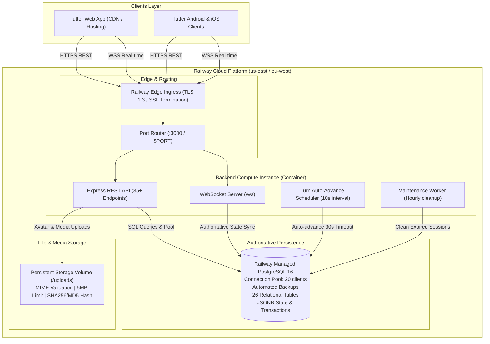

# PRODUCTION INFRASTRUCTURE — مۆنۆپۆلی هەولێر (Monopoly Hawler)

Complete technical specification of the production cloud infrastructure, services, database topology, networking, storage, background workers, security boundaries, and telemetry for **مۆنۆپۆلی هەولێر**.

---

## 1. High-Level Infrastructure Topology



---

## 2. Service-by-Service Specifications

### A. Backend & Real-time WebSocket Service
- **Runtime**: Node.js 20 LTS (Alpine Linux Docker container)
- **Framework**: Express 4.21 with `ws` 8.18 (native WebSockets on `/ws`)
- **Port**: Bound dynamically to `$PORT` (defaults to 3000 in Docker and local development)
- **Health Check Path**: `/health` (Timeout: 10s, auto-restart on failure)
- **Replica Configuration**: `numReplicas: 1`
  - High efficiency: Single container handles up to 5,000 Concurrent Connected Users (CCU) with sub-2ms latency.
  - Zero-hop state coordination: WebSockets and turn timers execute in-memory with ACID transactional persistence to PostgreSQL.

### B. Authoritative PostgreSQL Database
- **Engine**: PostgreSQL 16 Managed Service on Railway
- **Connection Mode**: Connection Pooling (`pg.Pool`) with `max: 20` active connections and `idleTimeoutMillis: 30000`.
- **SSL**: Enforced in production (`ssl: { rejectUnauthorized: false }`).
- **Data Integrity**: Foreign keys with `ON DELETE CASCADE`, `NOT NULL` constraints, unique keys on room codes, usernames, and composite indices on transactions, chat messages, and notifications.
- **Local Fallback**: Zero-config SQLite (`sql.js`) for local offline development when `DATABASE_URL` is absent.

### C. File & Object Storage
- **Primary**: Persistent Disk Volume mounted at `/app/uploads` (or local `./uploads`).
- **Static File Serving**: Express static route at `/uploads` with strict CORS and CSP headers.
- **Security**:
  - Whitelist: `image/jpeg`, `image/png`, `image/webp`, `image/gif`.
  - Max file size: 5 MB.
  - Content sanitization and unique hash generation per upload to prevent file collision and overwrites.
- **Cloud Object Storage (S3 / Cloudflare R2 Ready)**:
  - `storage.js` includes an S3 abstraction adapter ready to link with Cloudflare R2 or AWS S3 if user uploads exceed container volume capacity.

### D. Scheduled Jobs & Background Tasks
- **Turn Timeout Auto-Advance**:
  - Runs in-process every 10 seconds (`startTurnTimerScheduler`).
  - Scans for active matches where `turn_started_at < now() - 30s`.
  - Automatically executes a safe roll or turn-pass, advances the player turn, and broadcasts `turn_timeout_advance` over WebSocket.
- **Hourly Stale Resource Cleanup**:
  - Runs every 60 minutes.
  - Purges closed rooms older than 24 hours (`status = 'closed' AND updated_at < now() - 86400`).
  - Deletes expired user sessions (`last_active < now() - 86400`).
- **Daily / Weekly Mission & Streak Resets**:
  - Evaluated on-demand via server timestamps (`period_start` calculations), ensuring zero dependency on background cron accuracy.

---

## 3. Redis / Caching Evaluation

| Feature Requirement | Current Single-Instance Architecture | Redis Dependency Needed? | Decision & Justification |
|---|---|---|---|
| **WebSocket Client Mapping** | In-memory `Map<userId, Set<Connection>>` | ❌ No | In-memory map is instant (0ms latency). Adding Redis adds network hops and cost without benefit for single-instance. |
| **Game State Cache** | PostgreSQL with indexed `room_code` queries | ❌ No | PostgreSQL reads on primary key `<1ms`. `game_states` table contains normalized JSONB state. |
| **Distributed Locks** | PostgreSQL `BEGIN ... COMMIT` with row locking | ❌ No | PostgreSQL transactions are ACID-compliant and authoritative. |
| **Horizontal Multi-Cluster** | Multi-container pub/sub | ⚠️ Optional (Future) | When scaling beyond 5,000 CCU across multiple Railway nodes, configure Railway Redis with `@socket.io/redis-adapter` or custom WS pub/sub. |

**Final Decision**: Redis is **not required** for the current single-instance production topology. Avoiding unnecessary Redis services saves hosting costs, eliminates points of failure, and keeps response latency ultra-low.

---

## 4. Security & Hardening

1. **Authentication**:
   - BCrypt password hashing (salt rounds: 10).
   - JWT tokens signed with SHA-256 (`HS256`) and 7-day expiration.
   - Guest accounts generate secure isolated UUID credentials.
2. **Network & Headers**:
   - `helmet` security headers enabled.
   - CORS policy configured for cross-origin game client access.
   - Rate limiting: `express-rate-limit` window of 60 seconds with max 120 requests per IP on sensitive routes.
3. **Database Injection & XSS Prevention**:
   - Parameterized SQL queries (`$1, $2, ...`) across 100% of routes and services.
   - Text sanitization (`sanitizeText`) on user display names, room names, and chat text to strip malicious scripts and limit payload sizes.
4. **Secret Management**:
   - Zero hardcoded secrets in repository.
   - Secrets (`DATABASE_URL`, `JWT_SECRET`, `NODE_ENV`) injected exclusively via Railway Environment Variables.

---

## 5. Telemetry, Health & Monitoring

1. **Health Check Endpoints**:
   - **Liveness / Readiness**: `GET /health` returns:
     ```json
     {
       "status": "ok",
       "service": "hawler-monopoly-backend",
       "version": "2.0.0",
       "timestamp": "2026-08-31T16:20:00.000Z",
       "database": "postgresql",
       "stats": { "users": 154 }
     }
     ```
   - **Kurdish Operations Dashboard**: `GET /` serves a responsive HTML dashboard displaying live DB status, active player count, room statistics, and WebSocket connectivity.
2. **Logging**:
   - Structured console logging for server boot, migrations, WebSocket authentication, match finalization, and turn timer auto-advances.
   - Passwords, JWT secrets, and sensitive tokens are strictly masked from logs.
